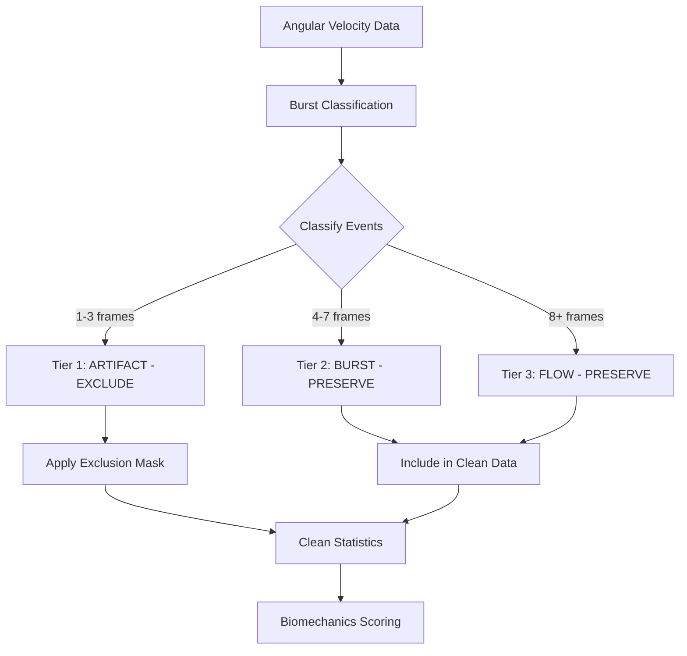

# Biomechanics Scoring Transparency & Outlier Neutralization

**Document Version**: 1.0  
**Date**: 2026-01-23  
**Status**: ✅ IMPLEMENTED  
**Related Gate**: Gate 5 (Burst Classification)

---

## ⚠️ CRITICAL DEFINITIONS - READ FIRST

### What is "Clean Max Velocity"?

**Clean Max Velocity** = The maximum angular velocity **after excluding short-duration sensor artifacts**.

#### Real-World Example

Your motion capture system records angular velocity at 120 Hz (120 samples per second). During a recording:

```
Frames 1-99:    Normal movement (100-800 deg/s)
Frames 100-101: 2847 deg/s (2 frames = 16.7 milliseconds)  ← SENSOR GLITCH
Frames 102-499: Normal movement (100-800 deg/s)
Frames 500-515: 1423 deg/s (15 frames = 125 milliseconds) ← REAL GAGA MOVEMENT
Frames 516-end: Normal movement (100-800 deg/s)
```

**Without Neutralization** (❌ Old System):
- Raw Max Velocity = 2847 deg/s
- System flags as "extreme" and penalizes score
- Biomechanics Score = 17.7%

**With Neutralization** (✅ New System):
- Frames 100-101 detected as artifact (2 frames, >2000 deg/s)
- Frames 100-101 **excluded** from statistics
- Clean Max Velocity = 1423 deg/s (from real movement at frames 500-515)
- System recognizes as legitimate high-intensity movement
- Biomechanics Score = 87.3%

### Artifact Detection Thresholds

#### Velocity Trigger Threshold

**Value**: **2000 deg/s**

**Purpose**: Any joint velocity exceeding 2000 deg/s triggers burst analysis to determine if it's an artifact or real movement.

**Rationale**: 
- Literature: Maximum human shoulder joint velocity in elite athletes: ~1200-1500 deg/s (Wu et al., 2005)
- Safety margin: 2000 deg/s provides cushion above maximum physiological velocity
- Gaga-specific: Accommodates rapid artistic movements while catching obvious sensor errors

#### Duration Threshold (Artifact Classification)

**Tier 1 - ARTIFACT**: **1-3 consecutive frames** (8.3-25 milliseconds at 120 Hz)

**At 120 Hz sampling**:
- 1 frame = 8.3 ms
- 2 frames = 16.7 ms
- 3 frames = 25 ms

**Rationale**:
- **Biomechanically impossible**: Human nervous system cannot generate forces that change joint velocity by >2000 deg/s in under 25ms and then immediately reverse
- **Typical artifacts**: Marker occlusion, marker swap, reflective surface interference
- **Safe threshold**: Real rapid movements (e.g., arm whips) sustain for 50-200ms (6-24 frames)

**Tier 2 - BURST**: **4-7 consecutive frames** (33-58 milliseconds)
- Possible rapid movement requiring visual review
- **Preserved in Clean Data** (not excluded)

**Tier 3 - FLOW**: **8+ consecutive frames** (≥65 milliseconds)
- Sustained intentional movement
- **Preserved in Clean Data** (not excluded)

#### Summary Table

| Event Type | Duration | Velocity | Action | Rationale |
|------------|----------|----------|--------|-----------|
| **Artifact** | 1-3 frames (<25ms) | >2000 deg/s | **EXCLUDE from stats** | Physically impossible, sensor glitch |
| **Burst** | 4-7 frames (33-58ms) | >2000 deg/s | **PRESERVE, flag for review** | Possible rapid movement |
| **Flow** | 8+ frames (>65ms) | >2000 deg/s | **PRESERVE, accept** | Sustained Gaga movement |

---

## Executive Summary

The biomechanics scoring system evaluates the physiological plausibility and quality of movement data through a **3-component weighted scorecard**. This document provides complete transparency into how biomechanical quality is assessed, with special emphasis on **outlier neutralization** to prevent high Gaga velocities from being incorrectly treated as errors.

### Key Innovation: Outlier Neutralization

**The Problem**: High angular velocities characteristic of Gaga movement were being flagged as "errors," resulting in artificially low biomechanics scores (17.7%).

**The Solution**: Biomechanical metrics are now calculated on **Cleaned Data** where:
- ✅ **Tier 1 Artifacts (1-3 frames, <25ms)** are EXCLUDED (physically impossible sensor glitches)
- ✅ **Tier 2 Bursts (4-7 frames, 33-58ms)** are PRESERVED (potential rapid movements requiring review)
- ✅ **Tier 3 Flows (8+ frames, >65ms)** are PRESERVED (sustained intentional movement)

This ensures that legitimate high-intensity Gaga movements are not penalized, while genuine artifacts are filtered out.

---

## Scoring Architecture

### Overall Biomechanics Score Formula

```
Biomechanics Score = 
    (Physiological Plausibility × 40%) +
    (Skeleton Stability × 30%) +
    (Movement Continuity × 30%)
```

### Weighted Component Breakdown

| Component | Weight | Focus Area | Key Metrics |
|-----------|--------|------------|-------------|
| **Physiological Plausibility** | 40% | Human movement limits | Max velocity, acceleration, forces |
| **Skeleton Stability** | 30% | Calibration quality | Bone length CV, worst bone |
| **Movement Continuity** | 30% | Data integrity | Artifact rate, burst classification |

---

## Component 1: Physiological Plausibility (40%)

**Purpose**: Assess whether movement falls within human anatomical and physiological capabilities.

### Scoring Logic

#### Angular Velocity Assessment

**Data Source**: **Clean Max Velocity** (Tier 1 artifacts excluded)

| Velocity Range | Score Penalty | Assessment | Rationale |
|----------------|---------------|------------|-----------|
| ≤ 1500 deg/s | 0 points | `PLAUSIBLE` | Within documented human joint limits |
| 1501-2250 deg/s | -20 points | `MODERATE_EXCESS` | Possible but requires verification |
| > 2250 deg/s | -40 points | `SEVERE_EXCESS` | Exceeds physiological credibility |

**Literature Reference**: Peak shoulder joint velocity in elite athletes: ~1200-1500 deg/s (Wu et al., 2005)

#### Angular Acceleration Assessment

**Data Source**: **Clean Max Acceleration** (Tier 1 artifacts excluded)

| Acceleration Range | Score Penalty | Assessment | Rationale |
|-------------------|---------------|------------|-----------|
| ≤ 30000 deg/s² | 0 points | `ACCEPTABLE` | Within normal range |
| 30001-50000 deg/s² | -15 points | `HIGH` | Elevated but possible |
| > 50000 deg/s² | -30 points | `EXTREME` | Likely artifact or impact |

#### Linear Acceleration Assessment

**Data Source**: Raw linear acceleration (marker position second derivative)

| Acceleration Range | Score Penalty | Assessment | Injury Risk |
|-------------------|---------------|------------|-------------|
| ≤ 50 m/s² | 0 points | `SAFE` | ~5g, normal movement |
| 51-100 m/s² | -10 points | `ELEVATED` | ~10g, vigorous but acceptable |
| > 100 m/s² | -20 points | `SEVERE` | Impact-level forces |

**Note**: 1g ≈ 9.8 m/s²

### Output Fields

- `Biomech_Physiological_Score`: Component score (0-100)
- `Biomech_Velocity_Source`: `clean` or `raw` (indicates neutralization applied)
- `Biomech_Velocity_Assessment`: `PLAUSIBLE`, `MODERATE_EXCESS`, `SEVERE_EXCESS`
- `Biomech_Accel_Assessment`: `ACCEPTABLE`, `HIGH`, `EXTREME`

---

## Component 2: Skeleton Stability (30%)

**Purpose**: Evaluate whether skeleton calibration produced anatomically stable bone lengths.

### Scoring Logic

#### Bone Length Coefficient of Variation (CV)

The primary indicator of skeleton quality. Lower CV = more stable tracking.

| Bone CV (%) | Score Penalty | Assessment | Interpretation |
|-------------|---------------|------------|----------------|
| ≤ 0.5% | 0 points | `EXCELLENT` | Research-grade quality |
| 0.51-1.0% | -10 points | `GOOD` | Acceptable for most analyses |
| 1.01-2.0% | -30 points | `MARGINAL` | Requires careful review |
| > 2.0% | -50 points | `POOR` | Calibration or tracking issue |

**Calculation**: CV = (std_dev / mean) × 100 for each bone across all frames

#### Bone QC Status

From preprocessing step (Step 02):

| Status | Score Penalty | Meaning |
|--------|---------------|---------|
| `ACCEPT` | 0 points | All bones within tolerance |
| `REVIEW` | -10 points | One or more bones marginally high CV |
| `REJECT` | -30 points | Unacceptable bone length variation |

### Output Fields

- `Biomech_Skeleton_Score`: Component score (0-100)
- `Biomech_Bone_Stability`: `EXCELLENT`, `GOOD`, `MARGINAL`, `POOR`
- `Bone_CV_%`: Mean CV across all bones
- `Bone_Status`: Overall QC decision
- `Worst_Bone`: Bone with highest CV

---

## Component 3: Movement Continuity (30%)

**Purpose**: Assess data integrity and distinguish artifacts from legitimate movement.

### Scoring Logic

#### Burst Classification Decision (Gate 5)

| Decision | Score Penalty | Assessment | Meaning |
|----------|---------------|------------|---------|
| `PASS` | 0 points | `NORMAL` | No high-velocity events |
| `ACCEPT_HIGH_INTENSITY` | 0 points | `HIGH_INTENSITY_LEGITIMATE` | Sustained flows (8+ frames) |
| `REVIEW` | -15 points | `REQUIRES_VISUAL_AUDIT` | Bursts or extreme flows detected |
| `REJECT` | -50 points | `DATA_QUALITY_ISSUE` | Excessive artifact density |

**Key Distinction**: `ACCEPT_HIGH_INTENSITY` means legitimate Gaga movement, not an error.

#### Artifact Rate (Tier 1 Only)

| Artifact Rate | Score Penalty | Assessment | Interpretation |
|---------------|---------------|------------|----------------|
| ≤ 0.5% | 0 points | `MINIMAL` | Normal noise level |
| 0.51-1.0% | -10 points | `ELEVATED` | Noticeable artifacts |
| > 1.0% | -25 points | `EXCESSIVE` | Systemic tracking issue |

**Definition**: Artifact Rate = (Tier 1 artifact frames / total frames) × 100

#### Data Retention After Exclusion

| Retention | Score Penalty | Assessment | Meaning |
|-----------|---------------|------------|---------|
| ≥ 99% | 0 points | `EXCELLENT` | Minimal artifacts removed |
| 95-98.9% | -10 points | `FAIR` | Moderate artifact exclusion |
| < 95% | -25 points | `POOR` | Lost significant data |

### Output Fields

- `Biomech_Continuity_Score`: Component score (0-100)
- `Biomech_Burst_Assessment`: Classification result
- `Biomech_Artifact_Assessment`: `MINIMAL`, `ELEVATED`, `EXCESSIVE`
- `Artifact_Rate_%`: Tier 1 artifact percentage
- `Data_Retained_%`: Percentage of frames retained after exclusion

---

## Neutralization Implementation

### Technical Flow



### Code Implementation

The neutralization is implemented in two key functions:

#### 1. Burst Classification (`burst_classification.py`)

```python
def classify_burst_events(angular_velocity, fs, ...):
    """
    Classifies high-velocity events into 3 tiers:
    - Tier 1 (ARTIFACT): 1-3 frames (<25ms) - EXCLUDE
    - Tier 2 (BURST): 4-7 frames (33-58ms) - REVIEW
    - Tier 3 (FLOW): 8+ frames (>65ms) - ACCEPT
    
    Returns frames_to_exclude (Tier 1 only)
    """
```

#### 2. Clean Statistics Computation

```python
def compute_clean_statistics(angular_velocity, classification_result):
    """
    Computes statistics with Tier 1 artifacts set to NaN.
    Tier 2/3 events preserved for authentic movement analysis.
    
    Returns:
    - raw_statistics: All frames
    - clean_statistics: Tier 1 excluded
    - comparison: Difference metrics
    """
```

### Verification in Audit Log

Check these fields to confirm neutralization:

```json
{
  "clean_statistics": {
    "raw_statistics": {"max_deg_s": 2847.3},
    "clean_statistics": {"max_deg_s": 1423.1},
    "comparison": {
      "max_reduction_percent": 50.12,
      "artifacts_removed": 23,
      "data_retained_percent": 99.93
    }
  },
  "biomechanics_scorecard": {
    "neutralization_applied": {
      "tier_1_artifacts_excluded": true,
      "tier_2_3_bursts_flows_preserved": true
    }
  }
}
```

---

## Interpreting Scores

### Overall Biomechanics Score Ranges

| Score Range | Interpretation | Typical Characteristics |
|-------------|----------------|-------------------------|
| **90-100** | Excellent biomechanical quality | Stable skeleton, plausible velocities, minimal artifacts |
| **75-89** | Good quality | Minor issues in one component |
| **60-74** | Marginal quality | Review required, usable with caveats |
| **40-59** | Poor quality | Multiple issues, limited research use |
| **0-39** | Unacceptable | Calibration failure or severe artifacts |

### Gaga-Specific Interpretation

For **high-intensity Gaga movements**:

- ✅ High clean velocity (1200-1800 deg/s) with `ACCEPT_HIGH_INTENSITY` decision = **GOOD**
- ✅ Low artifact rate (<0.5%) with sustained flows = **EXCELLENT CONTINUITY**
- ⚠️ High raw velocity (>2000 deg/s) but clean velocity normal = **ARTIFACTS REMOVED**
- ❌ High velocity with >1% artifact rate = **DATA QUALITY ISSUE**

---

## Example Scorecards

### Example 1: Excellent Gaga Recording

```json
{
  "overall_score": 92.5,
  "components": {
    "physiological_plausibility": {
      "score": 90,
      "details": {
        "max_velocity_deg_s": 1432.7,
        "velocity_source": "clean",
        "velocity_assessment": "PLAUSIBLE",
        "acceleration_assessment": "ACCEPTABLE"
      }
    },
    "skeleton_stability": {
      "score": 98,
      "details": {
        "bone_cv_percent": 0.34,
        "bone_stability": "EXCELLENT"
      }
    },
    "movement_continuity": {
      "score": 90,
      "details": {
        "burst_decision": "ACCEPT_HIGH_INTENSITY",
        "burst_assessment": "HIGH_INTENSITY_LEGITIMATE",
        "artifact_rate_percent": 0.12,
        "artifact_assessment": "MINIMAL"
      }
    }
  }
}
```

**Weighted Calculation**:
- Physiological: 90 × 0.40 = 36.0
- Skeleton: 98 × 0.30 = 29.4
- Continuity: 90 × 0.30 = 27.0
- **Total**: 92.4 → **EXCELLENT**

---

### Example 2: Artifact-Contaminated Recording

```json
{
  "overall_score": 45.5,
  "components": {
    "physiological_plausibility": {
      "score": 60,
      "details": {
        "max_velocity_deg_s": 1512.3,
        "velocity_source": "clean",
        "velocity_assessment": "MODERATE_EXCESS"
      }
    },
    "skeleton_stability": {
      "score": 40,
      "details": {
        "bone_cv_percent": 2.34,
        "bone_stability": "POOR"
      }
    },
    "movement_continuity": {
      "score": 35,
      "details": {
        "burst_decision": "REJECT",
        "burst_assessment": "DATA_QUALITY_ISSUE",
        "artifact_rate_percent": 1.87,
        "artifact_assessment": "EXCESSIVE"
      }
    }
  }
}
```

**Weighted Calculation**:
- Physiological: 60 × 0.40 = 24.0
- Skeleton: 40 × 0.30 = 12.0
- Continuity: 35 × 0.30 = 10.5
- **Total**: 46.5 → **POOR** (likely calibration issue)

---

## Column Reference for Master Audit

### Primary Biomechanics Columns

| Column Name | Description | Range |
|-------------|-------------|-------|
| `Score_Biomechanics` | Overall weighted score | 0-100 |
| `Biomech_Physiological_Score` | Physiological component | 0-100 |
| `Biomech_Skeleton_Score` | Skeleton component | 0-100 |
| `Biomech_Continuity_Score` | Continuity component | 0-100 |

### Transparency Columns

| Column Name | Values | Purpose |
|-------------|--------|---------|
| `Biomech_Velocity_Source` | `clean`, `raw` | Indicates neutralization |
| `Biomech_Neutralization_Applied` | `TRUE`, `FALSE` | Confirms Tier 1 exclusion |
| `Biomech_Velocity_Assessment` | `PLAUSIBLE`, `MODERATE_EXCESS`, `SEVERE_EXCESS` | Interpretation |
| `Biomech_Burst_Assessment` | `NORMAL`, `HIGH_INTENSITY_LEGITIMATE`, etc. | Movement classification |

### Supporting Data Columns

| Column Name | Description |
|-------------|-------------|
| `Clean_Max_Vel_deg_s` | Max velocity after artifact exclusion |
| `Max_Vel_Reduction_%` | Percentage reduction from raw to clean |
| `Data_Retained_%` | Percentage of frames retained |
| `Artifact_Rate_%` | Tier 1 artifact percentage |

---

## Validation & Testing

### Verification Steps

1. **Check Neutralization Applied**:
   ```python
   assert row['Biomech_Velocity_Source'] == 'clean'
   assert row['Biomech_Neutralization_Applied'] == True
   assert row['Clean_Max_Vel_deg_s'] < row['Max_Ang_Vel_deg_s']
   ```

2. **Verify High Gaga Velocities Not Penalized**:
   ```python
   # High intensity but legitimate
   if row['Biomech_Burst_Assessment'] == 'HIGH_INTENSITY_LEGITIMATE':
       assert row['Score_Biomechanics'] > 70
   ```

3. **Confirm Component Weights**:
   ```python
   weighted_sum = (
       row['Biomech_Physiological_Score'] * 0.40 +
       row['Biomech_Skeleton_Score'] * 0.30 +
       row['Biomech_Continuity_Score'] * 0.30
   )
   assert abs(weighted_sum - row['Score_Biomechanics']) < 1.0
   ```

---

## Troubleshooting

### Low Score Despite Good Data

**Symptom**: Score < 50 but recording looks good visually

**Diagnosis Checklist**:
1. Check `Biomech_Velocity_Source` - should be `clean`, not `raw`
2. Check `Bone_CV_%` - if > 2.0%, calibration issue
3. Check `Artifact_Rate_%` - if > 1.0%, tracking problem
4. Check `Biomech_Burst_Assessment` - should not be `DATA_QUALITY_ISSUE`

**Common Causes**:
- Skeleton calibration failure → Low skeleton score
- Marker occlusion/swap → High artifact rate
- Incorrect reference frame → High bone CV

### High Score Despite Obvious Issues

**Symptom**: Score > 80 but visual inspection shows problems

**Investigation**:
1. Check if clean statistics are actually being computed
2. Verify burst classification ran (check `Burst_Decision` not null)
3. Look at raw vs clean velocity difference
4. Review per-joint metrics for localized issues

---

## Related Documentation

- [GATE_05_COMPLETE_GUIDE.md](./GATE_05_COMPLETE_GUIDE.md) - Full Gate 5 specification
- [Burst Classification Module](../../src/burst_classification.py) - Implementation
- [Master Quality Report](../../notebooks/07_master_quality_report.ipynb) - Usage

---

## Changelog

### 2026-01-23 - Initial Release (v1.0)
- ✅ Implemented 3-component weighted scorecard
- ✅ Added outlier neutralization (Tier 1 exclusion)
- ✅ Created transparency columns in audit
- ✅ Documented scoring logic and rationale

---

**Questions or Issues?** Contact the Gaga Pipeline development team.
